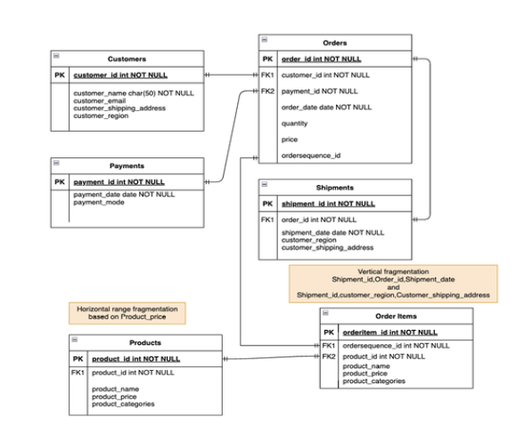
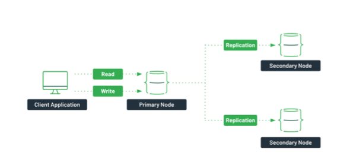

# E-Commerce-System

---

#### Introduction

This project involves the design, implementation, and management of a distributed database system, tailored to enhance data performance, scalability, and availability. The project integrates various database management techniques, including vertical and horizontal partitioning, distributed transaction management, and the use of NoSQL and relational database systems. The project specifically focuses on optimizing the management of customer information, orders, products, shipments, and payments in a distributed environment.

---

### Part 1: Distributed Database Schema and Data Insertion

#### Overview
The foundational structure of the distributed database is laid out in the schema, which includes multiple interconnected tables such as `Customer`, `Payments`, `Orders`, `Products`, `Shipments`, and `OrderItems`. This schema supports efficient data organization and retrieval. The project utilizes the PostgreSQL database system to implement these tables with detailed attributes, keys, and constraints.

#### Key Components:
1. **Customer Table**:
   - Attributes: `customer_id`, `customer_name`, `customer_email`, `customer_shipping_address`, `customer_region`
   - Primary Key: `customer_id`
2. **Payments Table**:
   - Attributes: `payment_id`, `payment_date`, `payment_mode`
   - Primary Key: `payment_id`
3. **Orders Table**:
   - Attributes: `order_id`, `customer_id`, `order_date`, `payment_id`, `quantity`, `price`, `order_sequence_id`
   - Composite Primary Key: `order_id`, `order_sequence_id`
4. **Products Table**:
   - Attributes: `product_id`, `product_name`, `product_price`, `product_categories`
   - Primary Key: `product_id`
5. **Shipments Table**:
   - Attributes: `shipping_id`, `order_id`, `shipment_date`, `customer_shipping_address`, `customer_region`
   - Primary Key: `shipping_id`
     

#### Data Insertion Mechanism
Data is inserted into these tables using Python scripts that leverage the Faker library to generate realistic and random data. The `insert_random_data` function ensures that the data is appropriately distributed across partitions, particularly for the `Products` table, based on the `product_price` field.

---

### Part 2: Fragmentation and Replication Techniques

#### Vertical and Horizontal Partitioning
To optimize performance and manage large datasets, both vertical and horizontal partitioning techniques were employed.

1. **Vertical Partitioning**:
   - New tables, `SHIPMENT_DETAILS_TABLE` and `CUSTOMER_DETAILS_TABLE`, were created from the original `Shipments` table to enhance data retrieval performance.
   
2. **Horizontal Partitioning**:
   - The `Products` table was divided into three separate tables based on product price ranges: `Products_10_to_100`, `Products_101_to_250`, and `Products_251_to_500`. This approach enables efficient management of product data and improves query performance.

#### Replication Setup
A peer-to-peer replication model was implemented to increase data availability and fault tolerance. A centralized table, `Customer_Region`, was created to consolidate region-specific data, simplifying the replication structure and ensuring data is distributed and replicated efficiently.

---

### Part 3: PostgreSQL Indexing

#### Index Creation
Indexes were created on several tables to improve query performance:

1. **APJ Region**: 
   - Index: `customer_name_apj` on `customer_region_apj(customer_name)`
2. **EMEA Region**: 
   - Index: `customer_name_emea` on `customer_region_emea(customer_name)`
3. **LATAM Region**: 
   - Index: `customer_name_latam` on `customer_region_latam(customer_name)`
4. **Generic Customer Table**:
   - Index: `customer_name_` on `customer(customer_name)`

These indexes enhance query performance for operations involving the `customer_name` column, leading to faster data retrieval and improved efficiency.

---

### Part 4: Distributed Transaction Management in MongoDB

#### Distributed MongoDB Setup
The project also incorporated a NoSQL database, MongoDB, for handling distributed transactions. A MongoDB cluster was set up using Docker to represent a distributed database environment with three instances acting as primary and secondary replicas.

#### Key Steps:
1. **Docker Network Creation**: A network named `ecommerceMongoCluster` was created.
2. **Replica Set Initialization**: The setup involved initializing a replica set to manage distributed transactions.
3. **Transaction Management**: MongoDB's distributed transaction management system was used to ensure ACID properties are preserved across the distributed environment.

#### Results
The MongoDB setup demonstrated effective handling of distributed transactions, ensuring data consistency, integrity, durability, and isolation across multiple nodes.
---

### Part 5: NoSQL Implementation in MongoDB

#### MongoDB CRUD Operations
MongoDB was selected for managing data related to the e-commerce domain. The project involved the implementation of CRUD operations and aggregation pipelines for data retrieval.

1. **Data Model**:
   - Attributes: `customer_name`, `customer_email`, `customer_shipping_address`, `customer_region`
   - Data generated using Mockaroo was inserted into the MongoDB database.

2. **Aggregation Pipelines**:
   - Functions like `get_customers_detail_location` and `get_customers_detail_name` were used to retrieve specific customer details based on region and name, demonstrating MongoDB’s powerful data retrieval capabilities.

#### Execution Results
The CRUD operations and aggregation pipelines were successfully executed, showing that MongoDB is effective for managing and querying large datasets in a distributed environment.

---

### Conclusion

This project successfully implemented a distributed database system using both PostgreSQL and MongoDB, integrating various advanced techniques like partitioning, indexing, replication, and distributed transaction management. The combined approach enhances data availability, scalability, performance, and reliability, making it suitable for managing large-scale e-commerce data across different regions and platforms. The techniques employed provide valuable insights into optimizing database management in distributed systems.
